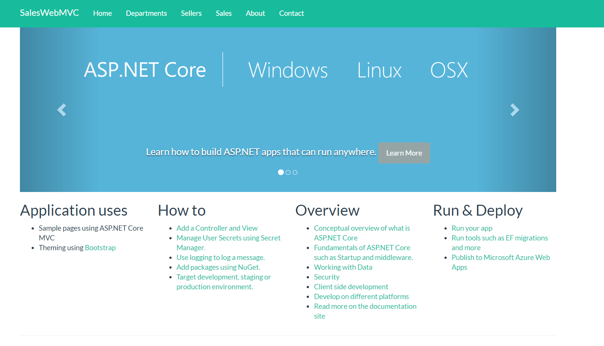
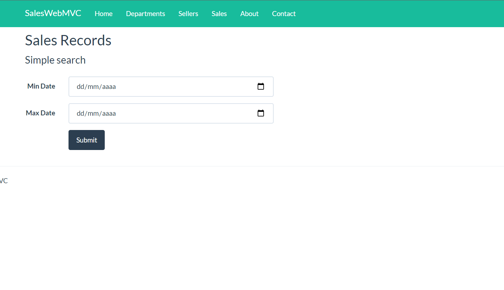
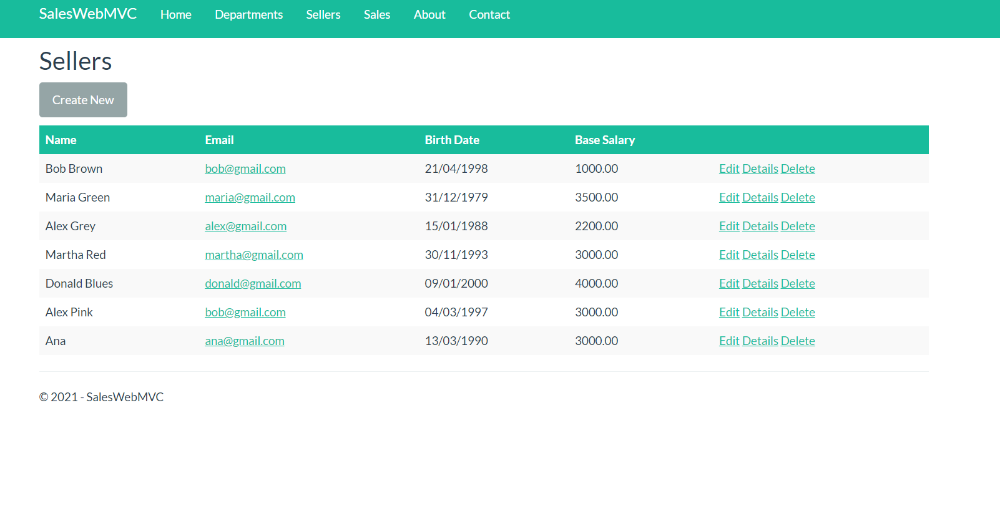

# ASPNET Core MVC - Básico.

projeto básico de estudo, desenvolvimento de aplicações web com ASP.NET Core MVC
usando os  fundamentos e a utilização do framework.
<br />
<br />
serviços utilizadas:
CRUD Scaffolding</br>
MySQL adaptation and migration</br>
Validation</br>
Asynchronous operations using Tasks (async, await)</br>
Implementing simple search</br>


## 🖼 Screenshot das telas da aplicação <br/>
<p>Tela Inicial</p>
<br/>
<br/>
<p>Vendas</p>
<br/>
<br/>
<p>Tela De Vendedores</p>
<br/>
<br/>
<p>Tela de pesquisar vendas</p>
<br/>
<br/>
<p>Tela cadastro de vendedores e alteração</p>
<br/>
<br/>


<br/>
## 🚀 Tecnologias utilizadas <br/>
<br/>


- C#  asp net<br/>
- Mysql <br/>
- html e css e um pouco de Javascript <br/>
- Razor <br/>
<br/>

## 🚀 Como usar <br/>

```bash
# no arquivo SalesWebMVC/appsettings.json, na linha:
    "SalesWebMVCContext": "Server=localhost;Database=saleswebmvcappdb;Uid=root;Pwd=Futebol#366;";
     terá que mudar para o Servidor do seu mysql ";
# Entrar numa IDE de sua preferência 


```


## Linkedin abaixo

<h4 align="center">
   Feito com Por   <a href="https://www.linkedin.com/in/luiz-carlos-b50693173/" target="_blank"> Luiz Carlos </a>
</h4>

</html>
